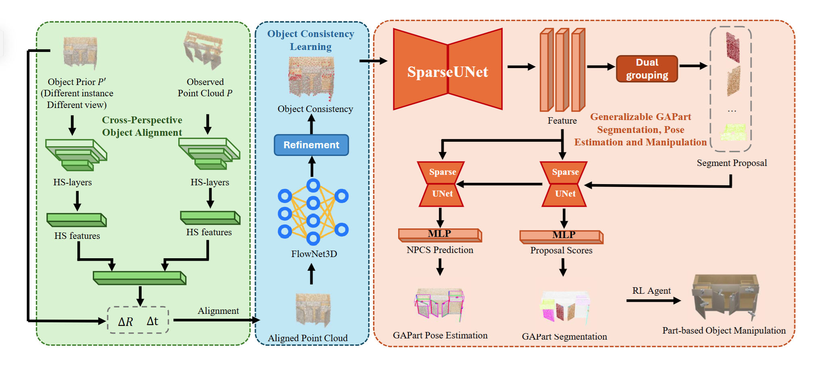
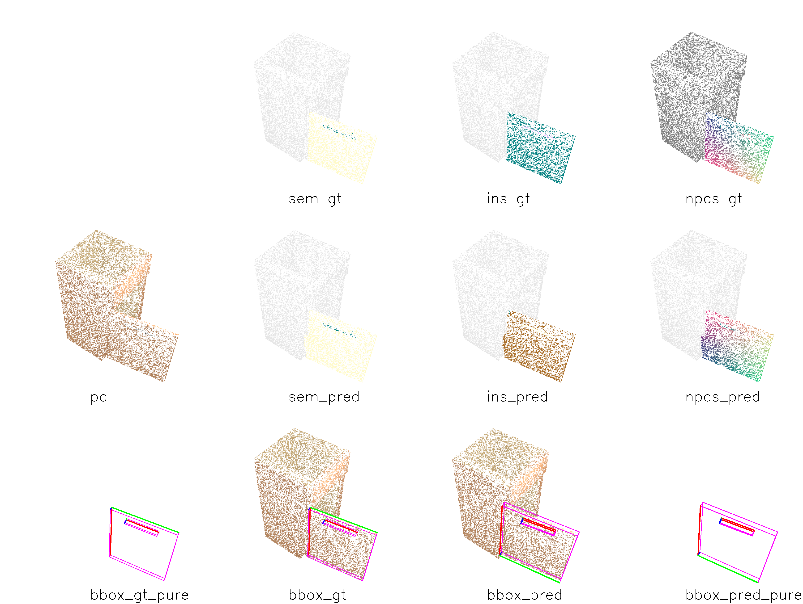

## Code for GASEM

Official implementation of ICME 2025 [GASEM: Boosting Generalized and Actionable Parts Segmentation and Pose Estimation via Object Motion Perception]().

<!-- Workshop paper notification: April 25, 2025 -->

pipeline:

## Install environment

### 1. Install dependencies
  - Python 3.10 (Python >= 3.8 Recommended)
  - Pytorch >= 1.11.0
  - CUDA >= 11.3 (11.8 Recommended)
  - Open3D with extension (For open3d cuda support)
  - epic_ops (For GAPartNet)
  - pointnet2_ops (Recommend to use lib in flownet3d repo)
  - other pip packages (We don't provide a requirements.txt because you need to compile and install some libraries)

### 2. Install GAPartNet_env
  See this repo for more details:
  
  [GAPartNet_env](https://github.com/geng-haoran/GAPartNet_env): This repo includes Open3D, [epic_ops](https://github.com/geng-haoran/epic_ops) and pointnet2_ops. You can install them by following the instructions in this repo.

### 3. Install dependence for Flownet3D and GPV-Pose
  See this repo for more details:

  [Flownet3D](https://github.com/hyangwinter/flownet3d_pytorch) and [GPV-Pose](https://github.com/lolrudy/GPV_Pose) 

## Prepare datasets

### 1. Download data for GAPartNet dataset. 

  Download GAPartNet `GAPartNet_PartNetMobility.zip` following [GAPartNet](https://github.com/PKU-EPIC/GAPartNet) REPO. 

### 2. Render data
  
  Our dataset is rendered by tools in `render_with_pose` folder, which is modified from [this folder](https://github.com/PKU-EPIC/GAPartNet/tree/release/dataset). We rerender the GAPartNet dataset to get rotation annotations for GPVNet's training process. You can set parameters by editing [config_utils.py](./render_with_pose/render_tools/utils/config_utils.py). Speciall you can change the `FIX_CAMERA` option to choose whether to render dataset with fixed rotation and translation, which is needed for `train_ins_fixed_camera.py`. 

## Run our experiments

  We release our train result (tensorboard) in `log_dir/` folder and GPVNet pre-trained model in `checkpoints/` folder. Due to file size limit, you can contact us to get other weights. 

### 1. Copy flownet3d release model
  
  Copy flownet3d offical release model as [flownet.pth](https://github.com/hyangwinter/flownet3d_pytorch/blob/master/pretrained_model/model.best.t7) to checkpoints folder. 

### 2. Train or use our release GPVNet model for alignment 
  ```bash
  python train_GPV.py \
    --root_dir=/path/to/train \
    --test_intra_dir=/path/to/test_intra \
    --test_inter_dir=/path/to/test_inter
  ```

### 3. Train
  
  For normal gapartnet dataset, run `train_ins_seg.py`. 
  ```bash
  # Our method
  python train_ins_seg.py \
    --root_dir=/path/to/train \
    --test_intra_dir=/path/to/test_intra \
    --test_inter_dir=/path/to/test_inter
  
  # GAPartNet method
  python train_ins_seg.py \
    --root_dir=/path/to/train \
    --test_intra_dir=/path/to/test_intra \
    --test_inter_dir=/path/to/test_inter \
    --no_train_with_flow
  ```
  If you have fixed-camera dataset, You can run `train_ins_fixed_camera.py` for ablation experiments. 
  ```
  # Our method
  python train_ins_fixed_camera.py \
    --root_dir=/path/to/train \
    --test_intra_dir=/path/to/test_intra \
    --test_inter_dir=/path/to/test_inter
  
  # GAPartNet method
  python train_ins_fixed_camera.py \
    --root_dir=/path/to/train \
    --test_intra_dir=/path/to/test_intra \
    --test_inter_dir=/path/to/test_inter \
    --no_train_with_flow
  ```
  If you want to do more ablation experiments, you can try it for different arguments. Such as:
  ```
  # Just replace color data by flow data, and run GAPartNet method. 
  python train_ins_fixed_camera.py \
    --root_dir=/path/to/train \
    --test_intra_dir=/path/to/test_intra \
    --test_inter_dir=/path/to/test_inter \
    --gap_and_flow
  
  # Run fixed-camera method for free-camera dataset
  python train_ins_seg.py \
    --root_dir=/path/to/train \
    --test_intra_dir=/path/to/test_intra \
    --test_inter_dir=/path/to/test_inter \
    --no_cat_features

  # Use icp method to replace flownet
  python train_ins_seg.py \
    --root_dir=/path/to/train \
    --test_intra_dir=/path/to/test_intra \
    --test_inter_dir=/path/to/test_inter \
    --no_cat_features --use_icp

  # You can find more comparisons in the argparser section of the code. 
  ```

### 4. Appendix
An example:


<!-- If you find our work useful, please cite it as:  -->
<!-- ``` -->

<!-- ``` -->